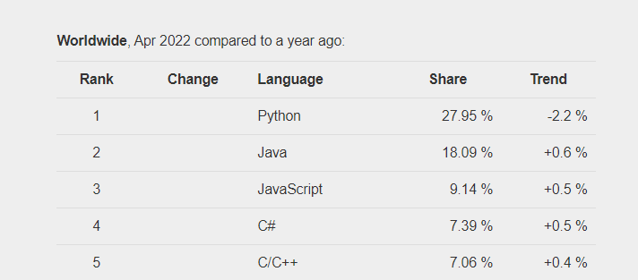
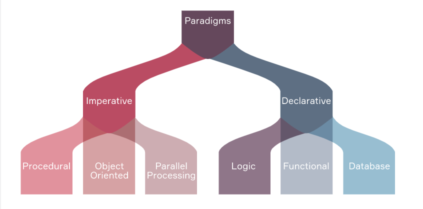

# Intro

### Computer programming

- make computers do tasks
- writing a set of instructions that a machine can understand
### Programming language:

- Programming teaches you how to think differently. It teaches you to think about how things work, and why they work this or that way. The coding process feels like a puzzle that you’re constantly trying to solve.
- Language is the tool you have in hand to solve the problem or direct computer to do task.

- [Popularity of programming Language](https://pypl.github.io/PYPL.html)
- 

### How to choose a computer language?
- it’s not really about choosing a language. It’s more about choosing a field. If you want to create Android apps, choose Kotlin; for iOS apps choose Swift, and if you want to develop games, learn C or C++. And if your answer to the question "why" is "to make a lot of money, idk", consider the most popular programming languages and start there.

### Paradigms

- Different approaches to creating programs are called paradigms.
- There are two main programming paradigms: imperative and declarative.
- 

- **Imperative paradigm**
  - oldest programming paradigms
  - closely related to machine architecture.
  - The imperative paradigm focuses on achieving a result using step-by-step instructions that change the data sequentially.
  - Imperative programming is divided into three broad categories: Procedural programming paradigm, Object-oriented programming, and Parallel processing approach.
  - **procedural programming paradigm**
    - is based upon the concept of procedure calls, in which statements are structured into procedures also known as subroutines or functions. They are a list of instructions to tell the computer what to do step by step
    - C, Java, C++, ColdFusion, Pascal.
  - **Object-oriented programming**
    - or OOP is the paradigm where the program is written as a collection of classes. Each class has its instances called objects.
    - Ruby, Java, C++, Python, Simula (the first OOP language), Smalltalk, Visual Basic .NET, Objective-C
  - **Parallel processing approach**
    - helps reduce instruction execution time
    - It does this by sharing or parallelizing instructions across multiple processors
    - C / C ++ 
- **Declarative paradigm**
  - The declarative paradigm focuses on the task and tries to get an expected result.
  - That is, in contrast to the imperative paradigm, where it is necessary to answer the question "how to do this?" you need to ask the questions "What needs to be done?" and "What will be the result of the work?".
  - **Logic programming paradigm**
    - its is a set of sentences in a logical form that express facts and rules about a certain problem area.
    - Basic statement in logical programming consists of facts, rules, queries. 
    - Datalog
  - **Functional programming paradigm**
    - input data in a function is not changd but as per logic specific in function it results into new data set. 
    - Here's a simple example: you might have a function that takes a list of numbers as input and returns a new list with the squares of those numbers. This does not change the original list of numbers
    - JavaScript, Haskell, Scala, Erlang, Lisp, ML, Clojure, OCaml, Common Lisp, and F#.
  - **Database programming paradigm**
    - This programming methodology is based on working with data. 
    - The data is stored in the database and queries are made to this database in a special language, for example, SQL
    - Program statements are data-defined rather than a hard-coded series of steps.
    - The database program is the heart of the business information system, allowing for file creation, data entry, updating, querying, and reporting functions.

