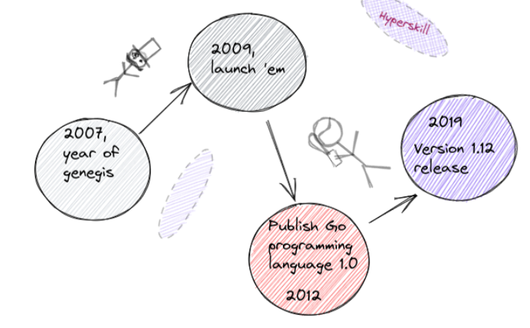
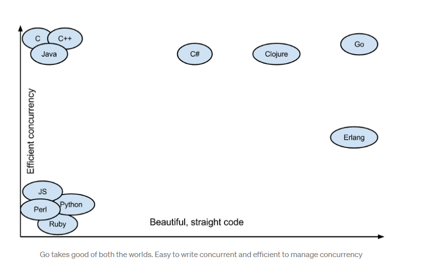
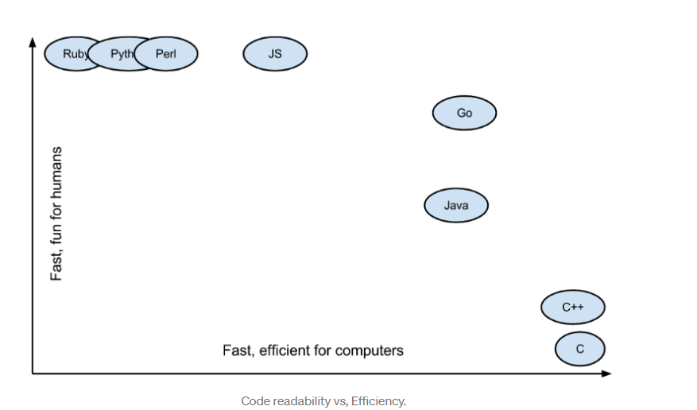

# Introduction to GO/Golang

- In 2007, Google began developing the Go programming language as an internal project. Two Unix luminaries, Rob Pike and Ken Thompson, designed the original
- 

## Advantages:

- clean Syntax
- Efficient: Go programs usually execute very fast and have a low memory footprint.
  - used in the server-centric world of web servers, storage architecture
  - compiled to native code directly while in java its first compiled to binary(.class) and then jvm interpret it to native code. 
- Golang excels at handling massive concurrency and making event-processing easy
  - good choice for game servers and IoT solutions

- general programming language
  - great tool for developing scripts and solving text-processing problems.
  
- Go success stories: https://github.com/golang/go/wiki/SuccessStories

- The language supports a range of programming paradigms, including imperative programming, object-oriented programming, procedure, and functional programming

- Efficient code vs Beautiful Code: 
- Code Readability vs Efficiency : 

## Disadvantages
- Go's standard library lacks many basic functions (for example, finding the biggest number in a slice of numbers), so you have to implement them by hand.
- As a result, Go's standalone binaries are large, because they require the embed garbage collector and the entire Go runtime as well. The "Hello World" program might consume 2MB in file size.

## Go FAQ's

- https://go.dev/doc/faq#Design

## Who is using GO

- Netflix for heavy data processing
- Uber for microservices
- Adobe for server handling
- Apple 
- Docker is written in Go
- Kubernetes is written in Go
- Mozilla is written in Go